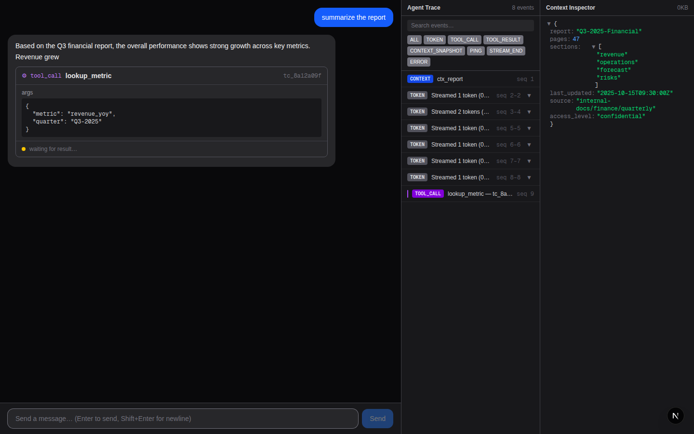
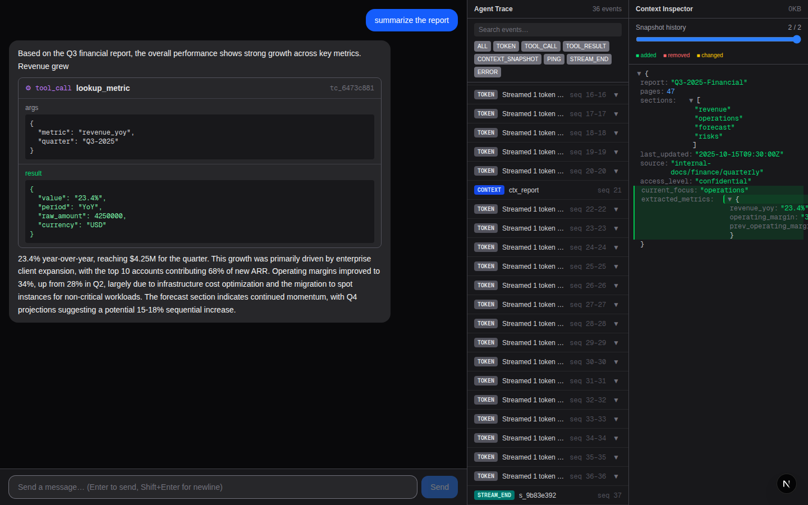
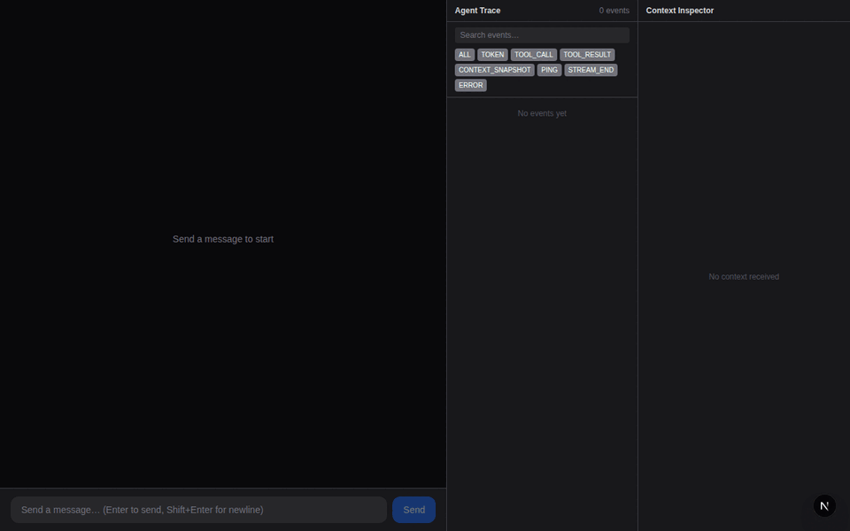

# Agent Console

A real-time AI agent interface built on Next.js 16 App Router. Connects to the `agent-server` WebSocket backend, renders streaming responses with mid-stream tool call interruptions, displays a live agent trace timeline, and survives chaos mode (connection drops, out-of-order messages, corrupt heartbeats, 500KB+ context payloads) without crashing or losing state.

## Architectural Approach

A singleton `WsManager` class (zero React) owns the entire WebSocket lifecycle — TCP handshake, PING/PONG heartbeat, exponential-backoff reconnection, and seq-ordered delivery via a `SequenceBuffer`. React only observes three Zustand stores (`chatStore`, `timelineStore`, `contextStore`); the split between what the socket has *received* and what the DOM has *consumed* is made explicit by `SequenceBuffer.getLastProcessed()`, which drives the `RESUME` message on reconnect. Token rendering uses a `requestAnimationFrame`-batched flush (60 Hz cap) to absorb 30+ token/s bursts without janking the render loop.

## WebSocket State Machine

```
                    ┌─────────────────────────────────────┐
                    │                                     ▼
  [start] ──► idle ──► connecting ──► resuming ──► connected
                             │           ▲              │
                             │    RESUME sent           │ WS close
                             │    (last_seq > 0)        ▼
                             │                    disconnected
                             │                          │
                             │                          ▼
                             └──────────────────── reconnecting
                                  backoff timer         │
                                  fires (500ms,         │
                                  1s, 2s, 4s,           │
                                  8s, 10s cap)          │
                                                        └──► connecting
```

| State | Meaning |
|---|---|
| `idle` | No connection attempted |
| `connecting` | TCP + WebSocket handshake in progress |
| `resuming` | Socket open; `RESUME` sent with `last_seq`; awaiting replay |
| `connected` | Active session; handling TOKEN / TOOL_CALL / PING |
| `disconnected` | Unintentional close detected; about to schedule reconnect |
| `reconnecting` | Waiting for backoff timer before next attempt |

Transitions:
- **idle → connecting**: `connect()` called on first page load
- **connecting → connected**: socket opened, `last_seq === 0` (fresh session)
- **connecting → resuming**: socket opened, `last_seq > 0` → sends `RESUME` as first message
- **resuming → connected**: `RESUME` sent; server begins replaying missed events
- **connected → disconnected**: `onclose` fires with `intentionalClose = false`
- **disconnected → reconnecting**: `scheduleReconnect()` arms the backoff timer
- **reconnecting → connecting**: timer fires → `openSocket()` creates new WebSocket
- **any → idle**: `disconnect()` called (sets `intentionalClose = true`, skips reconnect)

## Running the App

### Prerequisites

- Node.js 20+
- Agent server running on `ws://localhost:4747`

### 1. Start the agent server

```bash
cd agent-server
npm run build        # first time only
npm start            # normal mode

# chaos mode:
node dist/index.js --mode chaos
```

> The assignment ships a Dockerised server. If Docker is unavailable, build and run with Node directly as shown above.

### 2. Start the frontend

```bash
cd agent-console
npm install          # first time only
npm run dev          # http://localhost:3000

# production build:
npm run build && npm start
```

Open **http://localhost:3000** in your browser.

### 3. Verify protocol compliance

After sending a few messages:

```bash
curl http://localhost:4747/log | python3 -m json.tool
```

All entries should show `"verdict": "ok"` with zero violations — PONG responses timely, TOOL_ACK sent, RESUME correct after drops.

### 4. Automated integration test

```bash
cd agent-console
node test-agent.mjs
```

Drives the full flow via Playwright (hello streaming + report summary tool call) and prints the `/log` compliance summary.

### 5. Unit tests

```bash
cd agent-console
npm test
```

13 test cases covering `SequenceBuffer` reorder/dedup logic: empty buffer, single element, sorted, reversed, duplicates, mid-gap fills, force-flush timeout, post-flush arrivals.

## Screenshots

### (a) Tool call mid-stream — stream frozen, card shows "waiting for result…"



### (b) Tool call complete — result rendered, streaming resumed


### (c) Agent Trace Timeline with TOKEN batching, filter bar, and TOOL_CALL linkage


### (d) Context Inspector — second `ctx_report` snapshot diff (green = added keys)

After the `lookup_metric` result, the agent sends a second `ctx_report` snapshot adding `current_focus` and `extracted_metrics`. The inspector diffs and highlights changes.



## Chaos Mode Demo

Recorded against `--mode chaos`. Shows: streaming with TOKEN batching, mid-stream TOOL_CALL interruption, **chaos latency spike** (tool card stuck "waiting for result…" for ~20s while chaos injects delay), TOOL_RESULT finally arriving and streaming resuming, second `ctx_report` context snapshot in the inspector, PING heartbeat events in the timeline, and the large database-schema context snapshot loading without UI freeze.



**What to look for in the GIF:**
- `lookup_metric` tool card appears mid-sentence — stream freezes cleanly, no layout shift
- Card stays in "waiting for result…" for an extended time (chaos latency spike: 2–8s)
- When result arrives, card updates and streaming resumes from the exact token boundary
- Timeline accumulates TOKEN batches, TOOL_CALL, TOOL_RESULT, CONTEXT_SNAPSHOT, and PING rows simultaneously
- Context Inspector shows `ctx_session` and `ctx_report` tabs; second snapshot diff highlighted in green

## Project Structure

```
agent-console/
├── src/
│   ├── app/
│   │   ├── page.tsx              # root — mounts useWebSocket once
│   │   └── layout.tsx
│   ├── lib/
│   │   ├── protocol/
│   │   │   ├── types.ts          # mirrors agent-server protocol types
│   │   │   ├── SequenceBuffer.ts # reorder + dedup buffer (GAP_TIMEOUT=200ms)
│   │   │   └── WsManager.ts      # WebSocket lifecycle, zero React
│   │   ├── stores/
│   │   │   ├── connectionStore.ts
│   │   │   ├── chatStore.ts      # segment-based message model
│   │   │   ├── timelineStore.ts  # rAF-batched token events (60Hz)
│   │   │   └── contextStore.ts   # snapshot history + jsonDiff
│   │   └── diff/
│   │       └── jsonDiff.ts       # recursive DiffNode tree
│   ├── hooks/
│   │   └── useWebSocket.ts       # single-mount hook; window singleton guard
│   └── components/
│       ├── ChatPanel/            # MessageBubble, ToolCallCard
│       ├── TimelinePanel/        # @tanstack/react-virtual list, FilterBar
│       ├── ContextPanel/         # JsonTree (lazy expand), history scrubber
│       ├── ConnectionStatus.tsx
│       └── InputBar.tsx
└── src/__tests__/
    └── SequenceBuffer.test.ts
```
